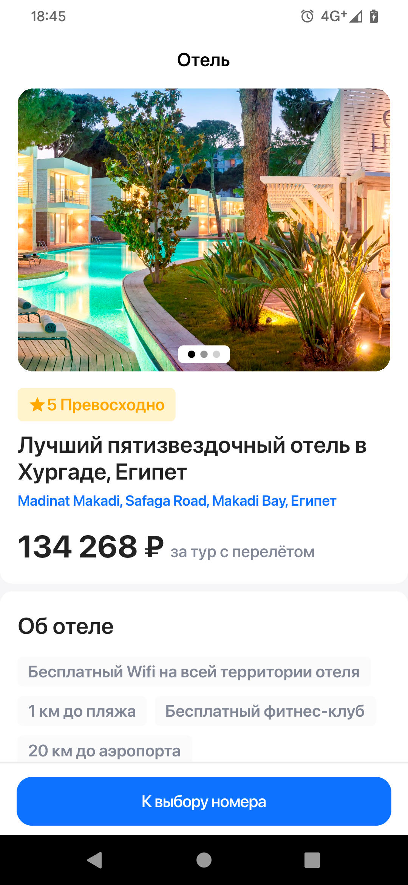
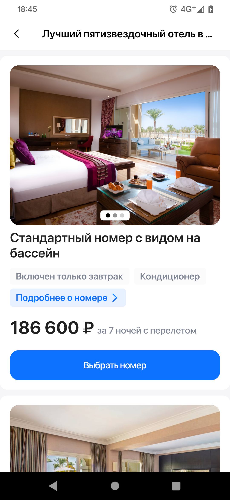

# b00king

### Тестовое задание - приложение, имитирующее бронирование номера в отеле.
#### Выполнено с опорой на Clean Architecture.

  
   
   
   

### Стек технологий:
 - Dart, Flutter
   - BLoC (Cubit)
   - Retrofit

### Прочие зависимости:
 - [carousel_slider](https://pub.dev/packages/carousel_slider)
 - [mask_text_input_formatter](https://pub.dev/packages/mask_text_input_formatter)
 - [email_validator](https://pub.dev/packages/email_validator)
 - [dio](https://pub.dev/packages/dio)
 - [flutter_svg](https://pub.dev/packages/flutter_svg)
 - [build_runner](https://pub.dev/packages/build_runner) (для генерации кода Retrofit)
 - [json_annotation](https://pub.dev/packages/json_annotation) (для `build_runner`)
 - [json_serializable](https://pub.dev/packages/json_serializable) (для генерации кода Retrofit)

Макет Figma - [здесь](https://raw.githubusercontent.com/radibobovich/b00king/master/figma_design.png)
